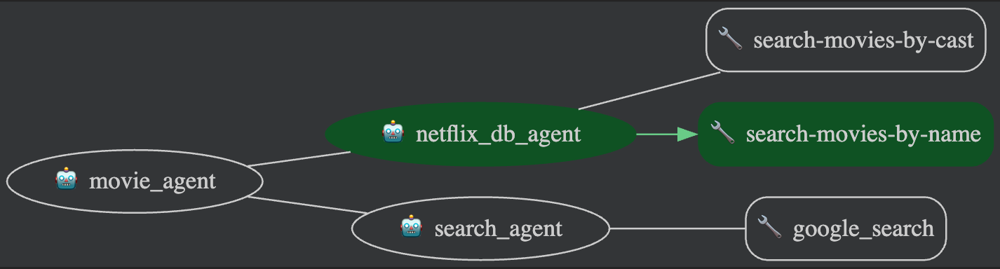
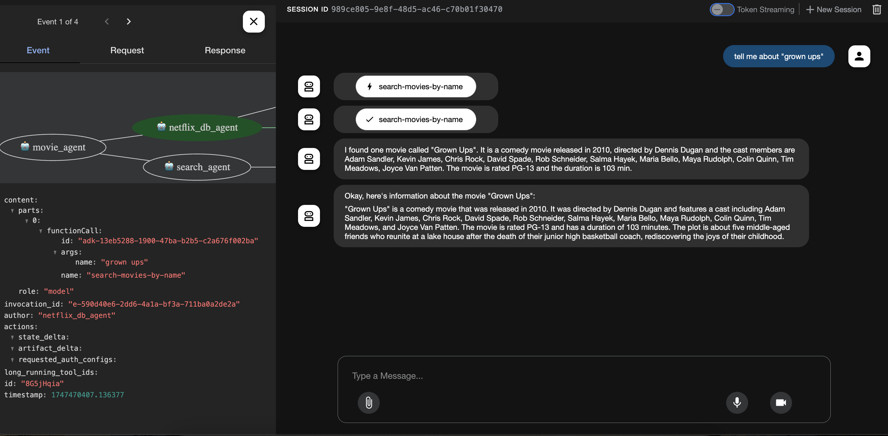

# Movie Agent


## Overview
A quick multi-agent starter project. Try to integrate MCP & google search via ADK. 
The agent will provide the information from Netflix sample DB and public information from gogole search. 
Root agent will sequentially call sub agents to provide information. 
 

*   **netflix_db_agent** agent use [MCP toolbox](https://github.com/googleapis/genai-toolbox) to query postgresql
    * netflix sample database: https://www.kaggle.com/datasets/shivamb/netflix-shows
*   **search_agent** agent use built-in google search to provide movie information 
    

This sample agent enables a user to query movie on netflix and agent
also provide the movie information from internet


## Agent Details

The key features of the LLM Auditor include:

| Feature | Description |
| --- | --- |
| **Interaction Type** | Workflow |
| **Complexity**  | Easy |
| **Agent Type**  | Multi Agent |
| **Components**  | Tools: built-in Google Search |


### Agent architecture:

This diagram shows the detailed architecture of the agents and tools used
to implement this workflow.


## System Background

1.  **Prerequisites**

    *   Python 3.11+
    *   Google-Adk 0.4.0
    *   mcp toolbox for database
        * No avaliable binary for macbook, build by yourself
        
```
# build via go
go install github.com/googleapis/genai-toolbox@v0.5.0
go build

# find the binary 
ls $GOPATH/pkg
ls ~/go/bin/genai-toolbox
```
        

2. **Encountered Issues**

    * It is currently not possible to successfully run an agent orchestration flow within the ADK where a sub_agent (invoked by a primary LlmAgent) is configured with certain built-in tools, specifically tested with google_search. Attempting this pattern consistently results in a 400 INVALID_ARGUMENT error with the message Tool use with function calling is unsupported. (Ref: https://github.com/google/adk-python/issues/53)

        * The workaround from above issue is to use agent_tool as multi tools instead multi-agent
        * Another workaround is to use Sequential Agent like the sample agents from ADK, like [llm_auditor](https://github.com/google/adk-samples/tree/main/agents/llm-auditor)


## Result


