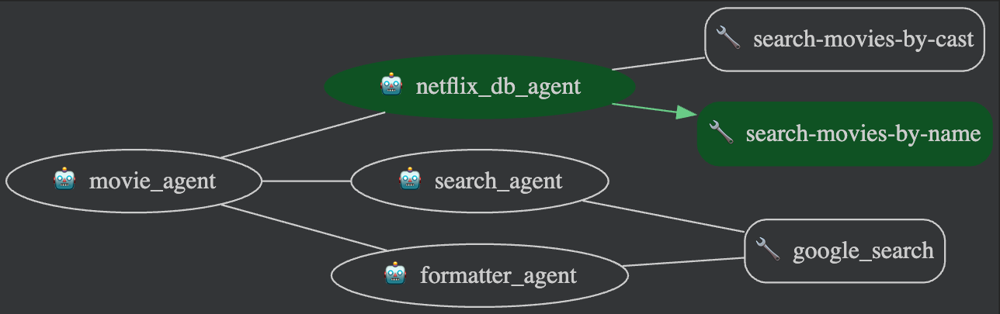

# Movie Agent


## Overview
A quick multi-agent starter project. Try to integrate MCP & google search via ADK. 
The agent will provide the information from Netflix sample DB and public information from gogole search. 
Root agent will sequentially call sub agents to provide information. 
 

*   **netflix_db_agent** agent use MCP to query netflix sample db on postgresql
*   **search_agent** search public movie information, like box office gross
*   **formatter_agent** combines the info from above two agents, and output them in markdown
    

<BR>

## Agent Details

The key features of the Movie Agent include:

| Feature | Description |
| --- | --- |
| **Interaction Type** | Workflow |
| **Complexity**  | Easy |
| **Agent Type**  | Multi Agent |
| **Components**  | Tools: built-in Google Search, MCP |

<BR>

### Agent architecture:

This diagram shows the detailed architecture of the agents and tools used
to implement this workflow.



| Sub Agent | Tools | Description |
| --- | --- | --- |
| **netflix_db_agent** | MCP | Query netflix sample db on local postgresql 
| **search_agent**  | build-in Google Search | Search movie information like box office gross via google search
| **formatter_agent**  | - | Combine two above agents info, and output them in markdown

<BR>

### Agent Details:

*   **netflix_db_agent** 
    * Use [MCP toolbox](https://github.com/googleapis/genai-toolbox) to query local postgresql
    * netflix sample database: https://www.kaggle.com/datasets/shivamb/netflix-shows
*   **search_agent** 
    * Use built-in google search to provide movie information, like US Box Office Gross
*   **formatter_agent** 
    * combines the state['netflix_record'] and state['internet_info'], and output them in markdown

<BR>

## System Background

1.  **Prerequisites**

    *   Python 3.11+
    *   Google-Adk 0.4.0
    *   [MCP toolbox for database](https://github.com/googleapis/genai-toolbox) 
        * No avaliable binary for macbook, build by yourself
                
        ```
        # build via go
        go install github.com/googleapis/genai-toolbox@v0.5.0
        go build

        # find the binary 
        ls $GOPATH/pkg
        ls ~/go/bin/genai-toolbox
        ```
        

2. **Encountered Issues**

    * It is currently not possible to successfully run an agent orchestration flow within the ADK where a sub_agent (invoked by a primary LlmAgent) is configured with certain built-in tools, specifically tested with google_search. Attempting this pattern consistently results in a 400 INVALID_ARGUMENT error with the message Tool use with function calling is unsupported. (Ref: https://github.com/google/adk-python/issues/53)

        * The workaround from above issue is to use agent_tool as multi tools instead multi-agent
        * Another workaround is to use Sequential Agent like the sample agents from ADK, like [llm_auditor](https://github.com/google/adk-samples/tree/main/agents/llm-auditor)


<BR>


## Result


<BR>
<BR>

## Reference
1. (Build a Travel Agent using MCP Toolbox for Databases and Agent Development Kit (ADK))[https://codelabs.developers.google.com/travel-agent-mcp-toolbox-adk#0]

2. (ADK sample agent - LLM Auditor)[https://github.com/google/adk-samples/tree/main/agents/llm-auditor]